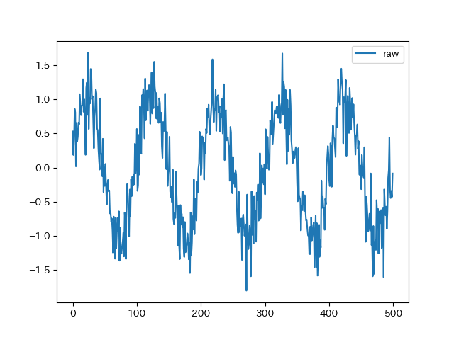
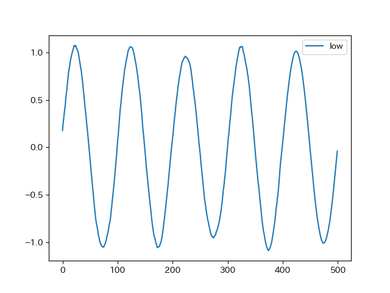
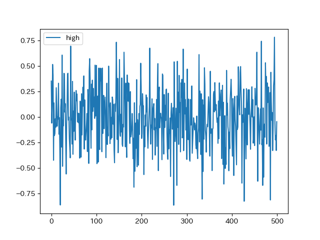
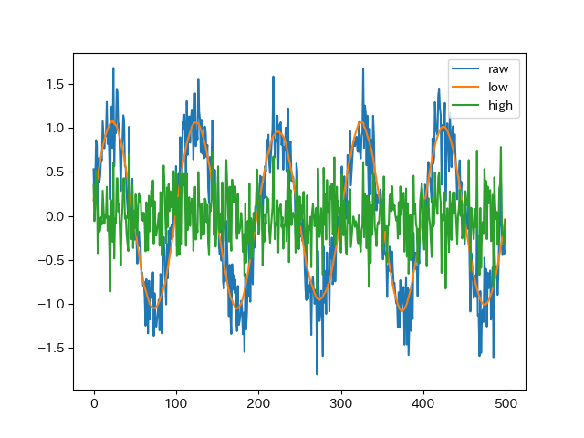

# Hankel Singular Value Decomposition

## Usage

```python
import numpy as np
from tfilter import hsvd

N = 500
x = np.sin(np.arange(N) * np.pi/50.0)
x = x + np.random.normal(0, 0.3, size=N)

window = 100
rank = 2
low_freq, high_freq = hsvd(x, window, rank)
```

## Example

```sh
python tfilter.py
```

### raw test data



### decomposition





### summary

