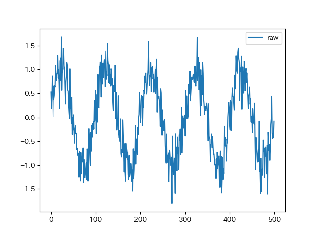
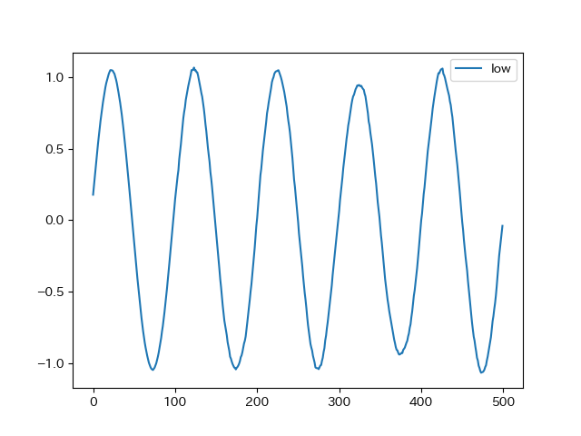
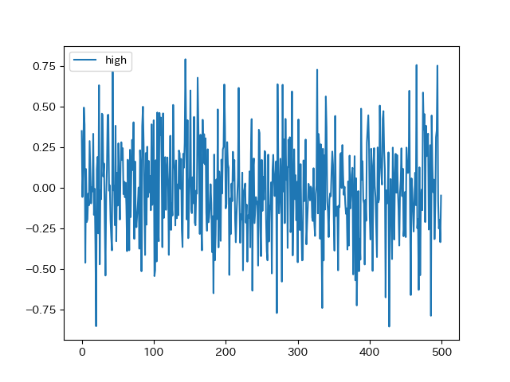
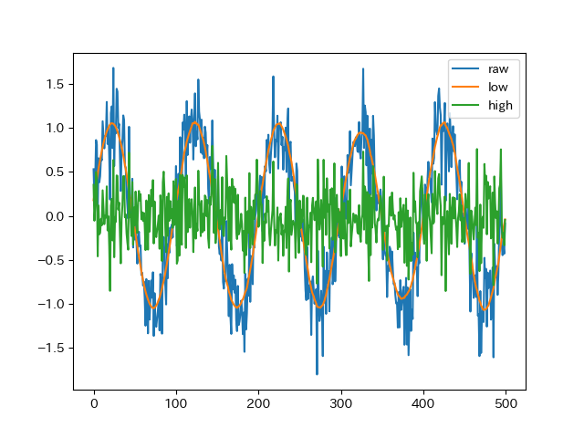

# Hankel Singular Value Decomposition

Implementation of [Smoothing Strategies Combined with ARIMA and Neural Networks to Improve the Forecasting of Traffic Accidents](https://www.hindawi.com/journals/tswj/2014/152375/)

## Usage

```python
import numpy as np
from tfilter import hsvd

N = 500
x = np.sin(np.arange(N) * np.pi/50.0)
x = x + np.random.normal(0, 0.3, size=N)

window = 100
rank = 2
low_freq, high_freq = hsvd(x, window, rank)
```

# Hankel Non-negative Matrix Factorization

Replacing SVD with NMF

time series data must be non-negative

## Usage

```python
import numpy as np
from tfilter import hnmf

N = 500
x = np.sin(np.arange(N) * np.pi/50.0)
x = x + np.random.normal(0, 0.3, size=N)
x = x + 2.0
assert(np.min(x) > 0.0)

window = 100
rank = 3
low_freq, high_freq = hnmf(x, window, rank)
```


# HSVD Example

## run

```sh
python tfilter.py
```

### raw test data



### decomposition





### summary

